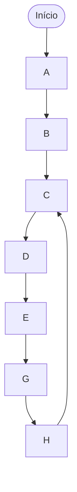

# Documentação do Microprocessador

Este documento descreve a arquitetura e o funcionamento do microprocessador
desenvolvido para o projeto.

---

## Arquitetura do Microprocessador

### Características Gerais

- **ULA**: Implementada com acumulador
- **Banco de Registradores**: 8 registradores disponíveis (R0-R7)
- **Tamanho da Instrução**: 15 bits
- **ROM**: Síncrona

### Ciclo de Instrução

Atualmente temos 3 estados: fetch (1°), decode (2°) e execute (3°)

1. **Estado 1**: Registrador de instruções com `wr_en` ativo
2. **Entre Estado 1 e 2**: Incremento do PC (PC+1) é gravado
3. **Último Estado**: Execução de instruções de salto (jump)

### Operações Suportadas

- **Carga de Constantes**: Via instrução LD (sem somar)
- **Soma**: Sempre entre um registrador e o acumulador (não suporta soma com constantes)
- **Subtração**: Entre um registrador e o acumulador ou com constantes
- **Saltos Condicionais**: BEQ (Branch if Equal) e BVS (Branch if Overflow Set)
- **Não há instruções exclusivas de comparação**

---

## Formato das Instruções

As instruções tem 15 bits e podem ser dos formatos **S** (**S**em constante),
**C** (**C**om constante) ou **J** (**J**ump)

### Formato S

```asm
XXX AAAA BBBB OOOO
```

| Campo | Bits   | Descrição                                    |
| ----- | ------ | -------------------------------------------- |
| **X** | 3 bits | Reservado/Não utilizado                      |
| **A** | 4 bits | Número do primeiro registrador (R0-R7 + ACC) |
| **B** | 4 bits | Número do segundo registrador (R0-R7 + ACC)  |
| **O** | 4 bits | Opcode da instrução                          |

### Formato C

```asm
AAAA CCCCCCC OOOO
```

| Campo    | Bits   | Descrição                                       |
| -------- | ------ | ----------------------------------------------- |
| **A**    | 4 bits | Número do primeiro registrador (R0-R7 + ACC)    |
| **C**    | 7 bits | Número do segundo registrador ou valor imediato |
| **OOOO** | 4 bits | Opcode da instrução                             |

---

## Conjunto de Instruções

### NOP

**Descrição**: Instrução sem operação. Não executa nenhuma ação, apenas
consome um ciclo de clock.

- **Opcode**: `0000`
- **Formato**: N/A (sem operandos)

**Exemplo**:

```asm
NOP ; Não faz nada
```

### ADD RX, A

**Descrição**: Soma o conteúdo de um registrador com o valor do acumulador e
armazena o resultado no acumulador.

- **Opcode**: `0001`
- **Formato**: S
- **Operandos**: Sempre dois registradores (um deles é o acumulador)
- **Restrição**: Não há soma com constantes

**Exemplo**:

```asm
ADD R4, A ; A = R4 + A
```

### SUB RX, A

**Descrição**: Subtrai do conteúdo de um registrador o valor do acumulador e
armazena o resultado no acumulador.

- **Opcode**: `0010`
- **Formato**: S
- **Operandos**: Sempre dois registradores (um deles é o acumulador)

**Exemplo**:

```asm
SUB R3, A ; A = R3 - A
```

### SUBI I, A

**Descrição**: Subtrai do valor imediato (constante) o valor do acumulador e
armazena o resultado no acumulador.

- **Opcode**: `0011`
- **Formato**: C
- **Operandos**: Acumulador e valor imediato de 7 bits

**Exemplo**:

```asm
SUBI 1, A ; A = 1 - A
```

### MV RX, RY

**Descrição**: Move (copia) o conteúdo de um registrador para outro registrador.
RX recebe o valor de RY.

- **Opcode**: `0100`
- **Formato**: S
- **Operandos**: Dois registradores (destino e origem)

**Exemplo**:

```asm
MV R5, R3 ; R5 = R3
```

### LD RX, I

**Descrição**: Carrega um valor imediato (constante) em um registrador.

- **Opcode**: `0101`
- **Formato**: C
- **Operandos**: Registrador de destino e valor imediato de 7 bits
- **Restrição**: Não realiza operações aritméticas, apenas carregamento

**Exemplo**:

```asm
LD R3, 5 ; R3 = 5
```

### JMP ADDRESS

**Descrição**: Salto incondicional para um endereço específico da memória.

- **Opcode**: `0110`
- **Formato**: C
- **Operandos**: Endereço de destino de 7 bits
- **Execução**: Realizado no último estado do ciclo de instrução

**Exemplo**:

```asm
JMP 20 ; PC = 20
```

---

## Programa de Teste (Lab 5)

### Objetivo

Implementar um programa na ROM que executa as seguintes operações em sequência:

### Pseudocódigo do Programa

| Passo | Descrição                     |
| ----- | ----------------------------- |
| A     | Carrega R3 com o valor 5      |
| B     | Carrega R4 com o valor 8      |
| C     | Soma R3 com R4 e guarda em R5 |
| D     | Subtrai 1 de R5               |
| E     | Salta para o endereço 20      |
| F     | Zera R5 _(nunca executada)_   |
| G     | Copia R5 para R3              |
| H     | Salta para o passo C (loop)   |
| I     | Zera R3 _(nunca executada)_   |

- **Passos F e I** nunca serão executados devido aos saltos incondicionais
- O programa entra em **loop infinito** entre os endereços 2 e 21
- A cada iteração do loop, R5 é recalculado e decrementado

### Fluxo de Execução



### Notas Importantes

- **Passos F e I** nunca serão executados devido aos saltos incondicionais
- O programa entra em **loop infinito** entre os endereços 2 e 21
- A cada iteração do loop, R5 é recalculado e decrementado

### Pograma

Assembly:

```asm
    ; A:
    ; Carrega R3 com o valor 5
    LD  R3, 5

    ; B:
    ; Carrega R4 com o valor 8
    LD  R4, 8

    ; C:
    ; Soma R3 com R4 e guarda em R5
C:  MV  A, R4
    ADD R3, A
    MV  R5, A

    ; D:
    ; Subtrai 1 de R5
    MV  A, R5
    SUBI 1, A
    MV  R5, A

    ; E:
    ; Salta para o endereço 20
    JMP E

    ; F:
    ; Zera R5 (Nunca executa)
    MV  A, R5
    SUB R5, A
    MV  R5, A

    /* Instruções aleatórias, apenas para preencher a ROM
       até o endereço 20 */
    NOP
    NOP
    NOP
    NOP
    NOP
    NOP
    NOP
    NOP

    ; G (Endereço 20):
    ; Copia R5 para R3
E:  MV R3, R5

    ; H
    ; Salta para o passo C
    JMP C

    ; I:
    ; Zera R3 (Nunca executa)
    MV  A, R3
    SUB R3, A
    MV R3, A
```

Binário:
