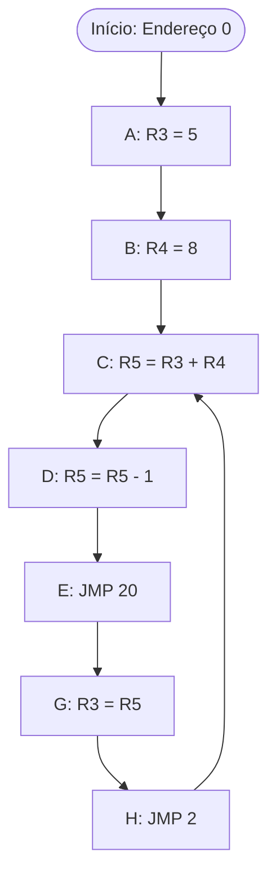

# Documentação do Microprocessador

Este documento descreve a arquitetura e o funcionamento do microprocessador
desenvolvido para o projeto.

---

## Arquitetura do Microprocessador

### Características Gerais

- **ULA**: Implementada com acumulador
- **Banco de Registradores**: 8 registradores disponíveis (R0-R7)
- **Tamanho da Instrução**: 15 bits
- **ROM**: Síncrona

### Ciclo de Instrução

Atualmente temos 3 estados: fetch (1°), decode (2°) e execute (3°)

1. **Estado 1**: Registrador de instruções com `wr_en` ativo
2. **Entre Estado 1 e 2**: Incremento do PC (PC+1) é gravado
3. **Último Estado**: Execução de instruções de salto (jump)

### Operações Suportadas

- **Carga de Constantes**: Via instrução LD (sem somar)
- **Soma**: Sempre entre um registrador e o acumulador (não suporta soma com constantes)
- **Subtração**: Entre um registrador e o acumulador ou com constantes
- **Saltos Condicionais**: BEQ (Branch if Equal) e BVS (Branch if Overflow Set)
- **Não há instruções exclusivas de comparação**

---

## Formato das Instruções

As instruções tem 15 bits e podem ser dos formatos **S** (**S**em constante)
ou **C** (**C**om constante)

### Formato S

```asm
XXX AAAA BBBB OOOO
```

| Campo | Bits   | Descrição                                    |
| ----- | ------ | -------------------------------------------- |
| **X** | 3 bits | Reservado/Não utilizado                      |
| **A** | 4 bits | Número do primeiro registrador (R0-R7 + ACC) |
| **B** | 4 bits | Número do segundo registrador (R0-R7 + ACC)  |
| **O** | 4 bits | Opcode da instrução                          |

### Formato C

```asm
AAAA CCCCCCC OOOO
```

| Campo    | Bits   | Descrição                                       |
| -------- | ------ | ----------------------------------------------- |
| **A**    | 4 bits | Número do primeiro registrador (R0-R7 + ACC)    |
| **C**    | 4 bits | Número do segundo registrador ou valor imediato |
| **OOOO** | 4 bits | Opcode da instrução                             |

---

## Conjunto de Instruções

### ADD A, RX

**Descrição**: Soma o conteúdo de um registrador com o valor do acumulador e
armazena o resultado no acumulador.

- **Opcode**: `0001`
- **Operandos**: Sempre dois registradores (um deles é o acumulador)
- **Restrição**: Não há soma com constantes

**Exemplo**:

```asm
ADD A, R4  // A = A + R4
```

---

## Programa de Teste (Lab 5)

### Objetivo

Implementar um programa na ROM que executa as seguintes operações em sequência:

### Pseudocódigo do Programa

| Passo | Descrição                     |
| ----- | ----------------------------- |
| A     | Carrega R3 com o valor 5      |
| B     | Carrega R4 com o valor 8      |
| C     | Soma R3 com R4 e guarda em R5 |
| D     | Subtrai 1 de R5               |
| E     | Salta para o endereço 20      |
| F     | Zera R5 _(nunca executada)_   |
| G     | Copia R5 para R3              |
| H     | Salta para o passo C (loop)   |
| I     | Zera R3 _(nunca executada)_   |

### Fluxo de Execução



### Notas Importantes

- **Passos F e I** nunca serão executados devido aos saltos incondicionais
- O programa entra em **loop infinito** entre os endereços 2 e 21
- A cada iteração do loop, R5 é recalculado e decrementado
