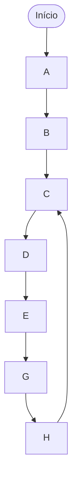

# Programa de Teste (Lab 5)

## Objetivo

Implementar um programa na ROM que executa as seguintes operações em sequência:

## Pseudocódigo do Programa

| Passo | Descrição                         | Endereço |
| ----- | --------------------------------- | -------- |
| A     | Carrega R3 com o valor 5          | 0        |
| B     | Carrega R4 com o valor 8          | 1        |
| C     | Soma R3 com R4 e guarda em R5     | 2-4      |
| D     | Subtrai 1 de R5                   | 5-8      |
| E     | Salta para o endereço 20          | 9        |
| F     | Zera R5 e NOP _(nunca executada)_ | 10-19    |
| G     | Copia R5 para R3                  | 20       |
| H     | Salta para o passo C (loop)       | 21       |
| I     | Zera R3 _(nunca executada)_       | 22-24    |

Observações:

- **Passos F e I** nunca serão executados devido aos saltos incondicionais
- O programa entra em **loop infinito** entre os endereços 2 e 21

## Fluxo de Execução



## Implementação do Programa

### Assembly

```asm
; ====================================
; A: Carrega R3 com o valor 5
; ====================================
LD  R3, 5

; ====================================
; B: Carrega R4 com o valor 8
; ====================================
LD  R4, 8

; ====================================
; C: Soma R3 com R4 e guarda em R5
; ====================================
C:  MV   A, R4      ; A = R4
    ADD  R3, A      ; A = R3 + A
    MV   R5, A      ; R5 = A

; ====================================
; D: Subtrai 1 de R5
; ====================================
    LD   R1, 1      ; R1 = 1
    MV   A, R1      ; A = 1
    SUB  R5, A      ; A = R5 - A
    MV   R5, A      ; R5 = A

; ====================================
; E: Salta para o endereço 20
; ====================================
    JMP  E

; ====================================
; F: Zera R5 (Nunca executa)
; ====================================
    MV   A, R5      ; A = R5
    SUB  R5, A      ; A = R5 - A
    MV   R5, A      ; R5 = A

; ====================================
; Instruções de preenchimento
; até o endereço 20
; ====================================
    NOP
    NOP
    NOP
    NOP
    NOP
    NOP
    NOP

; ====================================
; G (Endereço 20): Copia R5 para R3
; ====================================
E:  MV   R3, R5     ; R3 = R5

; ====================================
; H: Salta para o passo C
; ====================================
    JMP  C

; ====================================
; I: Zera R3 (Nunca executa)
; ====================================
    MV   A, R3      ; A = R3
    SUB  R3, A      ; A = R3 - A
    MV   R3, A      ; R3 = A
```

---

### Codificação Binária

#### Endereço 0: LD R3, 5

```
Formato: C
Opcode:  0101
A:       0011 (R3)
I:       0000101 (5)

Binário: 0011_0000101_0101
```

#### Endereço 1: LD R4, 8

```
Formato: C
Opcode:  0101
A:       0100 (R4)
I:       0001000 (8)

Binário: 0100_0001000_0101
```

#### Endereço 2: MV A, R4

```
Formato: S
Opcode:  0100
A:       1000 (ACC)
B:       0100 (R4)

Binário: 000_1000_0100_0100
```

#### Endereço 3: ADD A, R3

```
Formato: S
Opcode:  0001
A:       1000 (ACC)
B:       0011 (R3)

Binário: 000_1000_0011_0001
```

#### Endereço 4: MV R5, A

```
Formato: S
Opcode:  0100
A:       0101 (R5)
B:       1000 (ACC)

Binário: 000_0101_1000_0100
```

#### Endereço 5: LD, R1, 1

```
Formato: C
Opcode: 0101
A: 0001
I: 0000001

Binário: 0001_0000001_0101
```

#### Endereço 6: MV A, R1

```
Formato: S
Opcode:  0100
A:       1000 (ACC)
B:       0001 (R1)

Binário: 000_1000_0001_0100
```

#### Endereço 7: SUB A, R5

```
Formato: S
Opcode:  0010
A:       1000 (ACC)
B:       0101 (R5)

Binário: 000_1000_0101_0010
```

#### Endereço 8: MV R5, A

```
Formato: S
Opcode:  0100
A:       0101 (R5)
B:       1000 (ACC)

Binário: 000_0101_1000_0100
```

#### Endereço 9: JMP 20

```
Formato: C
Opcode:  0110
A:       0000 (não usado)
I:       0010100 (20)

Binário: 0000_0010100_0110
```

#### Endereço 10: MV A, R5

```
Formato: S
Opcode:  0100
A:       1000 (ACC)
B:       0101 (R5)

Binário: 000_1000_0101_0100
```

#### Endereço 11: SUB A, R5

```
Formato: S
Opcode:  0010
A:       1000 (ACC)
B:       0101 (R5)

Binário: 000_1000_0101_0010
```

#### Endereço 12: MV R5, A

```
Formato: S
Opcode:  0100
A:       0101 (R5)
B:       1000 (ACC)

Binário: 000_0101_1000_0100
```

#### Endereços 13-19: NOP (Preenchimento)

```
Formato: N/A
Opcode:  0000

Binário: 000_0000_0000_0000
```

#### Endereço 20: MV R3, R5

```
Formato: S
Opcode:  0100
A:       0011 (R3)
B:       0101 (R5)

Binário: 000_0011_0101_0100
```

#### Endereço 21: JMP 2

```
Formato: C
Opcode:  0110
A:       0000 (não usado)
I:       0000010 (2)

Binário: 0000_0000010_0110
```

#### Endereço 22: MV A, R3

```
Formato: S
Opcode:  0100
A:       1000 (ACC)
B:       0011 (R3)

Binário: 000_1000_0011_0100
```

#### Endereço 23: SUB A, R3

```
Formato: S
Opcode:  0010
A:       1000 (ACC)
B:       0011 (R3)

Binário: 000_1000_0011_0010
```

#### Endereço 24: MV R3, A

```
Formato: S
Opcode:  0100
A:       0011 (R3)
B:       1000 (ACC)

Binário: 000_0011_1000_0100
```

---

## Resumo da Memória ROM

| Endereço | Instrução Assembly | Código Binário     |
| -------- | ------------------ | ------------------ |
| 0        | LD R3, 5           | 0011_0000101_0101  |
| 1        | LD R4, 8           | 0100_0001000_0101  |
| 2        | MV A, R4           | 000_1000_0100_0100 |
| 3        | ADD A, R3          | 000_1000_0011_0001 |
| 4        | MV R5, A           | 000_0101_1000_0100 |
| 5        | LD R1, 1           | 0001_0000001_0101  |
| 6        | MV A, R1           | 000_1000_0001_0100 |
| 7        | SUB A, R5          | 000_1000_0101_0010 |
| 8        | MV R5, A           | 000_0101_1000_0100 |
| 9        | JMP 20             | 0000_0010100_0110  |
| 10       | MV A, R5           | 000_1000_0101_0100 |
| 11       | SUB A, R5          | 000_1000_0101_0010 |
| 12       | MV R5, A           | 000_0101_1000_0100 |
| 13-19    | NOP                | 000_0000_0000_0000 |
| 20       | MV R3, R5          | 000_0011_0101_0100 |
| 21       | JMP 2              | 0000_0000010_0110  |
| 22       | MV A, R3           | 000_1000_0011_0100 |
| 23       | SUB A, R3          | 000_1000_0011_0010 |
| 24       | MV R3, A           | 000_0011_1000_0100 |
