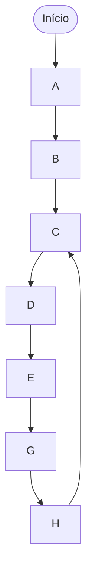

# Documentação do Microprocessador

Este documento descreve a arquitetura e o funcionamento do microprocessador
desenvolvido para o projeto.

---

## Arquitetura do Microprocessador

### Características Gerais

- **ULA**: Implementada com acumulador
- **Banco de Registradores**: 8 registradores (R0-R7)
- **Tamanho da Instrução**: 15 bits
- **ROM**: Síncrona

### Operações Suportadas

- **Carga de Constantes**: Via instrução LD (sem somar)
- **Soma**: Sempre entre um registrador e o acumulador (não suporta soma com constantes)
- **Subtração**: Entre um registrador e o acumulador ou com constantes
- **Saltos Condicionais**: BEQ (Branch if Equal) e BVS (Branch if Overflow Set)
- **Não há instruções exclusivas de comparação**

---

## Formato das Instruções

As instruções têm 15 bits e podem ser dos formatos:

- **Formato S**: **S**em constante (operações entre registradores)
- **Formato C**: **C**om constante ou salto incondicional

### Formato S

```asm
XXX AAAA BBBB OOOO
```

| Campo | Bits   | Descrição                                    |
| ----- | ------ | -------------------------------------------- |
| **X** | 3 bits | Reservado/Não utilizado                      |
| **A** | 4 bits | Número do primeiro registrador (R0-R7 + ACC) |
| **B** | 4 bits | Número do segundo registrador (R0-R7 + ACC)  |
| **O** | 4 bits | Opcode da instrução                          |

### Formato C

```asm
AAAA CCCCCCC OOOO
```

| Campo    | Bits   | Descrição                                         |
| -------- | ------ | ------------------------------------------------- |
| **A**    | 4 bits | Número do primeiro registrador (R0-R7 + ACC)      |
| **I**    | 7 bits | Valor imediato ou endereço do salto incondicional |
| **OOOO** | 4 bits | Opcode da instrução                               |

---

## Conjunto de Instruções

### Tabela de Instruções

| Instrução   | Opcode | Formato | Descrição                             |
| ----------- | ------ | ------- | ------------------------------------- |
| NOP         | `0000` | N/A     | Instrução sem operação                |
| ADD RX, A   | `0001` | S       | Soma registrador com acumulador       |
| SUB RX, A   | `0010` | S       | Subtrai acumulador de registrador     |
| SUBI I, A   | `0011` | C       | Subtrai acumulador de valor imediato  |
| MV RX, RY   | `0100` | S       | Move conteúdo entre registradores     |
| LD RX, I    | `0101` | C       | Carrega valor imediato em registrador |
| JMP ADDRESS | `0110` | C       | Salto incondicional                   |
| BEQ         | `0111` | C       | Salto condicional                     |
| BVS         | `1000` | C       | Salto condicional                     |

---

### NOP

**Descrição**: Instrução sem operação. Não executa nenhuma ação,
apenas consome um ciclo de clock.

- **Opcode**: `0000`
- **Formato**: N/A (sem operandos)

**Exemplo**:

```asm
NOP  ; Não faz nada
```

---

### ADD A, RX

**Descrição**: Soma o conteúdo de um registrador com o valor do acumulador
e armazena o resultado no acumulador.

- **Opcode**: `0001`
- **Formato**: S
- **Operandos**: Dois registradores (um deles é o acumulador)
- **Restrição**: Não há soma com constantes

**Sintaxe**: `ADD A, RX`

**Operação**: `A = RX + A`

**Exemplo**:

```asm
ADD A, R4  ; A = R4 + A
```

---

### SUB A, RX

**Descrição**: Subtrai do conteúdo de um registrador o valor do acumulador e
armazena o resultado no acumulador.

- **Opcode**: `0010`
- **Formato**: S
- **Operandos**: Dois registradores (um deles é o acumulador)

**Sintaxe**: `SUB A, RX`

**Operação**: `A = RX - A`

**Exemplo**:

```asm
SUB A, R3  ; A = R3 - A
```

---

### SUBI A, I

**Descrição**: Subtrai do valor imediato (constante) o valor do acumulador e
armazena o resultado no acumulador.

- **Opcode**: `0011`
- **Formato**: C
- **Operandos**: Acumulador e valor imediato de 7 bits

**Sintaxe**: `SUBI A, I`

**Operação**: `A = I - A`

**Exemplo**:

```asm
SUBI A, I  ; A = 1 - A
```

---

### MV RX, RY

**Descrição**: Move (copia) o conteúdo de um registrador para outro
registrador. RX recebe o valor de RY.

- **Opcode**: `0100`
- **Formato**: S
- **Operandos**: Dois registradores (destino e origem)

**Sintaxe**: `MV RX, RY`

**Operação**: `RX = RY`

**Exemplo**:

```asm
MV R5, R3  ; R5 = R3
```

---

### LD RX, I

**Descrição**: Carrega um valor imediato (constante) em um registrador.

- **Opcode**: `0101`
- **Formato**: C
- **Operandos**: Registrador de destino e valor imediato de 7 bits
- **Restrição**: Não realiza operações aritméticas, apenas carregamento

**Sintaxe**: `LD RX, I`

**Operação**: `RX = I`

**Exemplo**:

```asm
LD R3, 5  ; R3 = 5
```

---

### JMP ADDRESS

**Descrição**: Salto incondicional para um endereço da memória.

- **Opcode**: `0110`
- **Formato**: C
- **Operandos**: Endereço de destino de 7 bits

**Sintaxe**: `JMP ADDRESS`

**Operação**: `PC = ADDRESS`

**Exemplo**:

```asm
JMP 20  ; PC = 20
```

---

### BEQ ADDRESS

**Descrição**: Salto condicional para um endereço da memória se a flag Zero (Z)
estiver setada (igual a 1). Verifica se o resultado da última operação da ULA foi zero.

- **Opcode**: `0111`
- **Formato**: C
- **Operandos**: Endereço de destino de 7 bits
- **Condição**: Salta se Z = 1 (resultado da última operação foi zero)

**Sintaxe**: `BEQ ADDRESS`

**Operação**: `Salta se Z = 1 (resultado da última operação foi zero)`

**Exemplo**:

```asm
SUB A, R3    ; A = R3 - A (atualiza flags)
BEQ 10       ; Se resultado foi zero, salta para endereço 10
```

---

### BVS ADDRESS

**Descrição**: Salto condicional para um endereço da memória se a flag Overflow (V)
estiver setada (igual a 1). Verifica se houve overflow aritmético na última
operação da ULA.

- **Opcode**: `1000`
- **Formato**: C
- **Operandos**: Endereço de destino de 7 bits
- **Condição**: `PC = ADDRESS when V = '1' else PC + 1`

**Sintaxe**: `BVS ADDRESS`

**Operação**: `if (V == 1) then PC = ADDRESS`

**Exemplo**:

```asm
ADD A, R7    ; A = R7 + A (atualiza flags)
BVS ERRO     ; Se houve overflow, salta para rotina de erro
```

---

### BLT OFST

**Descrição**: Salto condicional para um endereço relativo da memória se a flag `flag_neg`
estiver setada (igual a 1). A flag é setada se o resultado da última operação feita
pela ULA foi menor que zero

- **Opcode**: `1001`
- **Formato**: C
- **Operandos**: Posição do endereço de destino em relação ao endereço atual
- **Condição**: `PC = PC + OFST when flag_neg = '1' else PC + 1`

**Sintaxe**: `BLT ADDRESS`

**Operação**: `if (flag_neg == 1) then PC = PC + OFST`

**Exemplo**:

```asm
SUB A, R7    ; A = R7 - A (atualiza flags)
BLT ERRO     ; Se R7 < A, salta para rotina de erro
```

---

## Programa de Teste (Lab 6)

### Objetivo

Implementar um programa na ROM que executa as seguintes operações em sequência:

### Pseudocódigo do Programa

| Passo | Descrição                         | Endereço |
| ----- | --------------------------------- | -------- |
| A     | Carrega R3 com o valor 5          | 0        |
| B     | Carrega R4 com o valor 8          | 1        |
| C     | Soma R3 com R4 e guarda em R5     | 2-4      |
| D     | Subtrai 1 de R5                   | 5-8      |
| E     | Salta para o endereço 20          | 9        |
| F     | Zera R5 e NOP _(nunca executada)_ | 10-19    |
| G     | Copia R5 para R3                  | 20       |
| H     | Salta para o passo C (loop)       | 21       |
| I     | Zera R3 _(nunca executada)_       | 22-24    |

Observações:

- **Passos F e I** nunca serão executados devido aos saltos incondicionais
- O programa entra em **loop infinito** entre os endereços 2 e 21

### Fluxo de Execução



## Implementação do Programa

### Assembly

```asm
; ====================================
; A: Carrega R3 com o valor 5
; ====================================
LD  R3, 5

; ====================================
; B: Carrega R4 com o valor 8
; ====================================
LD  R4, 8

; ====================================
; C: Soma R3 com R4 e guarda em R5
; ====================================
C:  MV   A, R4      ; A = R4
    ADD  R3, A      ; A = R3 + A
    MV   R5, A      ; R5 = A

; ====================================
; D: Subtrai 1 de R5
; ====================================
    LD   R1, 1      ; R1 = 1
    MV   A, R1      ; A = 1
    SUB  R5, A      ; A = R5 - A
    MV   R5, A      ; R5 = A

; ====================================
; E: Salta para o endereço 20
; ====================================
    JMP  E

; ====================================
; F: Zera R5 (Nunca executa)
; ====================================
    MV   A, R5      ; A = R5
    SUB  R5, A      ; A = R5 - A
    MV   R5, A      ; R5 = A

; ====================================
; Instruções de preenchimento
; até o endereço 20
; ====================================
    NOP
    NOP
    NOP
    NOP
    NOP
    NOP
    NOP

; ====================================
; G (Endereço 20): Copia R5 para R3
; ====================================
E:  MV   R3, R5     ; R3 = R5

; ====================================
; H: Salta para o passo C
; ====================================
    JMP  C

; ====================================
; I: Zera R3 (Nunca executa)
; ====================================
    MV   A, R3      ; A = R3
    SUB  R3, A      ; A = R3 - A
    MV   R3, A      ; R3 = A
```

---

### Codificação Binária

#### Endereço 0: LD R3, 5

```
Formato: C
Opcode:  0101
A:       0011 (R3)
I:       0000101 (5)

Binário: 0011_0000101_0101
```

#### Endereço 1: LD R4, 8

```
Formato: C
Opcode:  0101
A:       0100 (R4)
I:       0001000 (8)

Binário: 0100_0001000_0101
```

#### Endereço 2: MV A, R4

```
Formato: S
Opcode:  0100
A:       1000 (ACC)
B:       0100 (R4)

Binário: 000_1000_0100_0100
```

#### Endereço 3: ADD A, R3

```
Formato: S
Opcode:  0001
A:       1000 (ACC)
B:       0011 (R3)

Binário: 000_1000_0011_0001
```

#### Endereço 4: MV R5, A

```
Formato: S
Opcode:  0100
A:       0101 (R5)
B:       1000 (ACC)

Binário: 000_0101_1000_0100
```

#### Endereço 5: LD, R1, 1

```
Formato: C
Opcode: 0101
A: 0001
I: 0000001

Binário: 0001_0000001_0101
```

#### Endereço 6: MV A, R1

```
Formato: S
Opcode:  0100
A:       1000 (ACC)
B:       0001 (R1)

Binário: 000_1000_0001_0100
```

#### Endereço 7: SUB A, R5

```
Formato: S
Opcode:  0010
A:       1000 (ACC)
B:       0101 (R5)

Binário: 000_1000_0101_0010
```

#### Endereço 8: MV R5, A

```
Formato: S
Opcode:  0100
A:       0101 (R5)
B:       1000 (ACC)

Binário: 000_0101_1000_0100
```

#### Endereço 9: JMP 20

```
Formato: C
Opcode:  0110
A:       0000 (não usado)
I:       0010100 (20)

Binário: 0000_0010100_0110
```

#### Endereço 10: MV A, R5

```
Formato: S
Opcode:  0100
A:       1000 (ACC)
B:       0101 (R5)

Binário: 000_1000_0101_0100
```

#### Endereço 11: SUB A, R5

```
Formato: S
Opcode:  0010
A:       1000 (ACC)
B:       0101 (R5)

Binário: 000_1000_0101_0010
```

#### Endereço 12: MV R5, A

```
Formato: S
Opcode:  0100
A:       0101 (R5)
B:       1000 (ACC)

Binário: 000_0101_1000_0100
```

#### Endereços 13-19: NOP (Preenchimento)

```
Formato: N/A
Opcode:  0000

Binário: 000_0000_0000_0000
```

#### Endereço 20: MV R3, R5

```
Formato: S
Opcode:  0100
A:       0011 (R3)
B:       0101 (R5)

Binário: 000_0011_0101_0100
```

#### Endereço 21: JMP 2

```
Formato: C
Opcode:  0110
A:       0000 (não usado)
I:       0000010 (2)

Binário: 0000_0000010_0110
```

#### Endereço 22: MV A, R3

```
Formato: S
Opcode:  0100
A:       1000 (ACC)
B:       0011 (R3)

Binário: 000_1000_0011_0100
```

#### Endereço 23: SUB A, R3

```
Formato: S
Opcode:  0010
A:       1000 (ACC)
B:       0011 (R3)

Binário: 000_1000_0011_0010
```

#### Endereço 24: MV R3, A

```
Formato: S
Opcode:  0100
A:       0011 (R3)
B:       1000 (ACC)

Binário: 000_0011_1000_0100
```

---

## Resumo da Memória ROM

| Endereço | Instrução Assembly | Código Binário     |
| -------- | ------------------ | ------------------ |
| 0        | LD R3, 5           | 0011_0000101_0101  |
| 1        | LD R4, 8           | 0100_0001000_0101  |
| 2        | MV A, R4           | 000_1000_0100_0100 |
| 3        | ADD A, R3          | 000_1000_0011_0001 |
| 4        | MV R5, A           | 000_0101_1000_0100 |
| 5        | LD R1, 1           | 0001_0000001_0101  |
| 6        | MV A, R1           | 000_1000_0001_0100 |
| 7        | SUB A, R5          | 000_1000_0101_0010 |
| 8        | MV R5, A           | 000_0101_1000_0100 |
| 9        | JMP 20             | 0000_0010100_0110  |
| 10       | MV A, R5           | 000_1000_0101_0100 |
| 11       | SUB A, R5          | 000_1000_0101_0010 |
| 12       | MV R5, A           | 000_0101_1000_0100 |
| 13-19    | NOP                | 000_0000_0000_0000 |
| 20       | MV R3, R5          | 000_0011_0101_0100 |
| 21       | JMP 2              | 0000_0000010_0110  |
| 22       | MV A, R3           | 000_1000_0011_0100 |
| 23       | SUB A, R3          | 000_1000_0011_0010 |
| 24       | MV R3, A           | 000_0011_1000_0100 |
